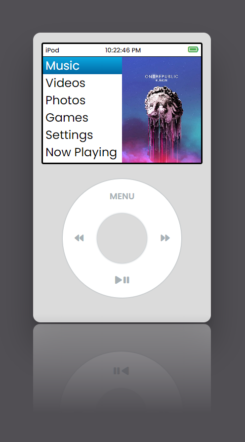
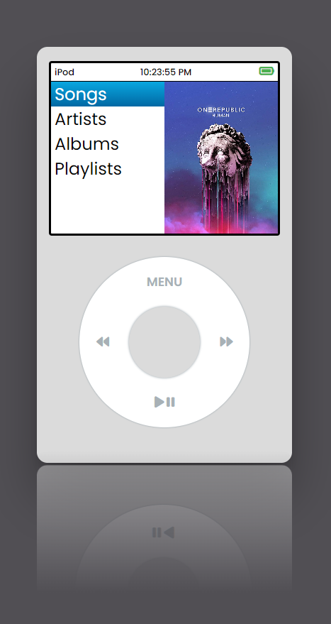
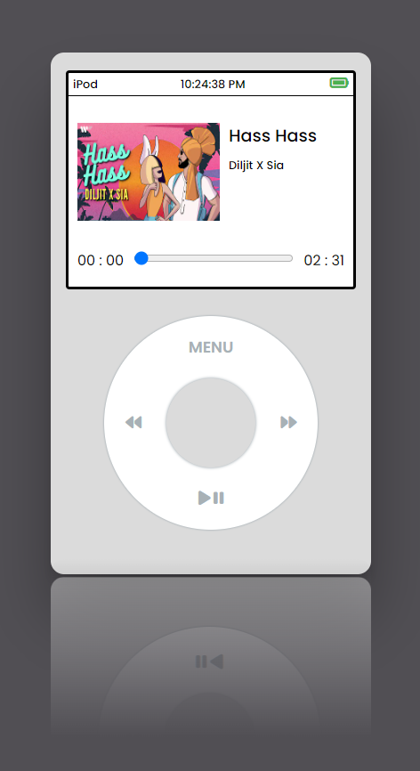

# iPod Classic Emulator

## Technologies Used
- **React:** React is a JavaScript library for building user interfaces. It allows for efficient updates to the UI by rendering components when the data changes.
- **ZingTouch:** ZingTouch is a JavaScript library for detecting gestures. It's used here to simulate the rotation gesture for navigating the iPod menu.
- **Audio API:** The Audio API is used to play audio files representing songs in the iPod emulator.

## Innovation and Features Added
- **Rotary Wheel Navigation:** The emulator replicates the classic iPod's iconic rotary wheel for navigation. Users can rotate the wheel to navigate through the menu options.
- **Interactive User Interface:** The UI is interactive, providing a tactile experience reminiscent of using the original iPod. Users can select menu options, play/pause songs, and navigate through the menu hierarchy.
- **Single Page Mode:** When navigating to a menu option without sub-pages, the emulator switches to single-page mode, displaying the selected content without further navigation.
- **Play Controls:** Users can play, pause, skip to the next or previous song using the emulator's controls, just like on the original iPod.

### Why These Technologies?
- **React:** React provides a robust framework for building interactive user interfaces. Its component-based architecture makes it well-suited for creating reusable UI elements, such as the menu items and play controls in the iPod emulator.
- **ZingTouch:** ZingTouch simplifies gesture detection, enabling the replication of the rotary wheel interaction. It enhances the user experience by providing a natural way to navigate through the menu options.
- **Audio API:** The Audio API is essential for playing audio files representing songs. By leveraging this API, the emulator can provide a realistic emulation of the original iPod's music playback functionality.

## Installation
To run the iPod Classic emulator locally, follow these steps:

1. Clone the repository to your local machine:
```
git clone https://github.com/Rishav-rj/iPod-classic.git
```

2. Navigate to the project directory:
```
cd ipod-classic
```

3. Install dependencies using npm or yarn:
```
npm install
```

4. Start the development server:
```
npm start
```

5. Open your web browser and visit `http://localhost:3000` to access the emulator.

## Usage
- **Navigation:** Hold mouse left click & rotate the wheel clockwise or counterclockwise to navigate through the menu options.
- **Selection:** Press the center button to select a menu option or song.
- **Playback Control:** Use the play/pause, next, and previous buttons to control music playback.
- **Menu Navigation:** Press the menu button to go back to the previous menu level.

## Screenshots




